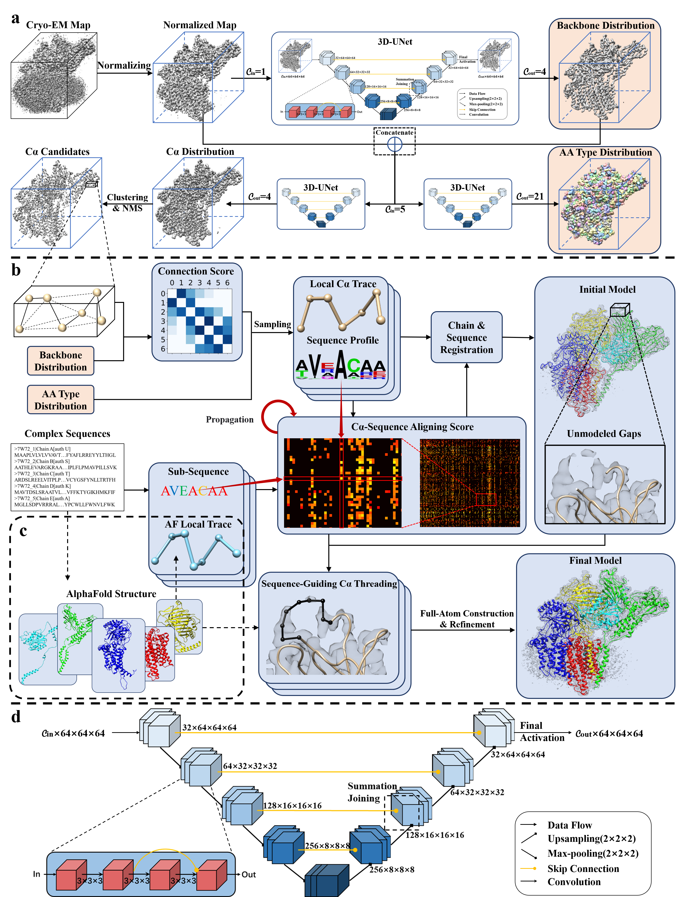

# EModelX
EModelX is a method for automatic cryo-EM protein complex structure modeling.

## Colab
EModelX can be run in Colab: [Minimal Example](https://colab.research.google.com/github/ChenShengsGitHub/EModelX_new/blob/main/minor_example.ipynb)  

## Environment
`conda env create -f EModelX.yml`  
For EModelX(+AF), you may need to run AlphaFold following <https://github.com/deepmind/alphafold> or get AlphaFold-predicted single-chain structures from AlphaFoldDB (<https://alphafold.ebi.ac.uk/>).  

## Download NN model weights
Download NN model weights from <https://drive.google.com/file/d/13BKzEBfL0uubYgcJJTGSZ-PkO9hXAB9X/view?usp=drive_link> and place them in `./models`.  

## Minimal Example: Main Chain Modeling for new EM maps

For EModelX:   
`python run.py --protocol=temp_free --EM_map=data/inputs/maps/emd_32336.map.gz --fasta=data/inputs/fastas/7w72 --output_dir=data/outputs --run_pulchra --pulchra_path modules/pulchra304/src/pulchra`  
For EModelX(+AF):   
`python run.py --protocol=temp_flex --EM_map=data/inputs/maps/emd_32336.map.gz --fasta=data/inputs/fastas/7w72 --template_dir=data/inputs/templates --output_dir=data/outputs --run_pulchra --pulchra_path=modules/pulchra304/src/pulchra`   
, where you can replace `--EM_map` with your target EM map   
, and `--fasta` with your target fasta   
, and `--template_dir`: directory of the template folder, only needed when --protocol == temp_flex   
, and `--output_dir`: the output directory for modeling results  
Notice: If you want to run EModelX(+AF), please place your AlphaFold-predicted single-chain structures in your `--template_dir`， the format should follow our example in ./inputs/templates.  

## Postprocess
### Environment
Install phenix following <https://phenix-online.org/> into a directory, e.g. `modules/phenix-1.20.1-4487`  

### Example
For EModelX:   
`python run.py --protocol=temp_free --EM_map=data/inputs/maps/emd_32336.map.gz --fasta=data/inputs/fastas/7w72 --output_dir=data/outputs --run_pulchra --pulchra_path=modules/pulchra304/src/pulchra --run_phenix --phenix_act=modules/phenix-1.20.1-4487/phenix_env.sh`  
For EModelX(+AF):   
`python run.py --protocol=temp_flex --EM_map=data/inputs/maps/emd_32336.map.gz --fasta=data/inputs/fastas/7w72 --template_dir=data/inputs/templates --output_dir=data/outputs --run_pulchra --pulchra_path=modules/pulchra304/src/pulchra --run_phenix --phenix_act=modules/phenix-1.20.1-4487/phenix_env.sh`

## Web Server
EModelX's web server is accessible at <https://bio-web1.nscc-gz.cn/app/EModelX>   
